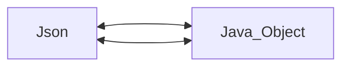

# Jackson Note

示範用的Json資料放在`demo.json`裡面


# 如何使用Jackson 

1. 創建objectMapper

```java
@Test
void JacksonTutorial(){
    ObjectMapper objectMapper = new ObjectMapper();

}
```

ObjectMapper用來幫助我們將Json與Java的Object互相轉換




2. 創建JsonNode物件

```java
@Test
void JacksonTutorial() throws JsonProcessingException {
    String demo = actuator.getActuatorThreadInformation();
    ObjectMapper objectMapper = new ObjectMapper();
    JsonNode jsonNode = objectMapper.readTree(demo);
}
```


3. 使用jsonNode的方法來取得Json的Key值

## 範例1 取得Key值

```java
@Test
void JacksonTutorial() throws JsonProcessingException {
    String demo = actuator.getActuatorThreadInformation();
    ObjectMapper objectMapper = new ObjectMapper();
    JsonNode jsonNode = objectMapper.readTree(demo);
    String threads = jsonNode.get("threads").get(0).get("stackTrace").get(0).get("classLoaderName").asText();
    System.out.println("threads = " + threads);  //threads = null
    
}
```

## 範例2 使用for-loop取得每個Array的值

```java
@Test
void JacksonTutorial() throws JsonProcessingException {
    String demo = actuator.getActuatorThreadInformation();
    ObjectMapper objectMapper = new ObjectMapper();
    JsonNode jsonNode = objectMapper.readTree(demo);
    String threads = jsonNode.get("threads").get(0).get("stackTrace").get(0).get("classLoaderName").asText();
    System.out.println("threads = " + threads);

    JsonNode jsonNode1 = objectMapper.readTree(demo).get("threads");
    for (JsonNode node : jsonNode1) {
        JsonNode threadName = node.get("threadName");
        System.out.println("threadName = " + threadName);
        /*
        threads = null
threadName = "Reference Handler"
threadName = "Finalizer"
threadName = "Signal Dispatcher"
threadName = "Attach Listener"
threadName = "Common-Cleaner"
threadName = "Monitor Ctrl-Break"
threadName = "Notification Thread"
threadName = "RMI TCP Accept-0"
threadName = "RMI Scheduler(0)"
threadName = "Catalina-utility-1"
threadName = "Catalina-utility-2"
threadName = "container-0"
threadName = "mysql-cj-abandoned-connection-cleanup"
threadName = "HikariPool-1 housekeeper"
threadName = "Live Reload Server"
threadName = "File Watcher"
threadName = "http-nio-8080-BlockPoller"
threadName = "http-nio-8080-exec-1"
threadName = "http-nio-8080-exec-2"
threadName = "http-nio-8080-exec-3"
threadName = "http-nio-8080-exec-4"
threadName = "http-nio-8080-exec-5"
threadName = "http-nio-8080-exec-6"
threadName = "http-nio-8080-exec-7"
threadName = "http-nio-8080-exec-8"
threadName = "http-nio-8080-exec-9"
threadName = "http-nio-8080-exec-10"
threadName = "http-nio-8080-ClientPoller"
threadName = "http-nio-8080-Acceptor"
threadName = "DestroyJavaVM"

        */
    }
}
```
